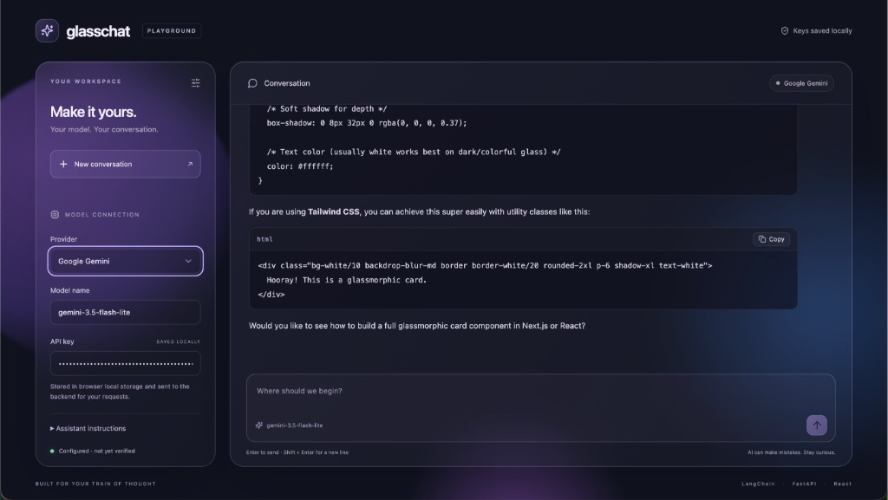
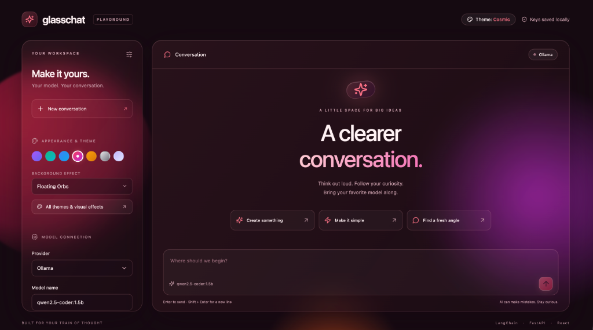

# 🔮✨ Glasschat

<p align="center">
  
</p>

<p align="center">
  <a href="https://react.dev"></a>
  <a href="https://fastapi.tiangolo.com"></a>
  <a href="https://www.python.org"></a>
  <a href="https://www.docker.com"></a>
  <a href="https://www.langchain.com"></a>
  <a href="https://vitejs.dev"></a>
</p>

A clean, readable, single-container LangChain chatbot with **FastAPI**, **React 19**, streamed Markdown replies, and a dark purple/blue glassmorphism interface. 

Switch effortlessly between **OpenAI**, **Anthropic**, **Google Gemini**, and local **Ollama** models directly from the sidebar. No database, no user accounts, zero bloat.

---

### 🌟 Key Features

- 🔮 **Glassmorphism Aesthetic**: Translucent frosted panels, backdrop blur, ambient neon orbs, and responsive design.
- ⚡ **Real-Time Streaming**: Low-latency token-by-token streaming over NDJSON.
- 🎨 **Custom Themes & Backgrounds**: Choose between 7 curated color palettes and 5 live background visual effects:
  - 🔮 **Amethyst Nebula** *(Default)* — Signature glowing violet, electric indigo & royal purple.
  - 🌲 **Emerald Aurora** — Deep obsidian teal, cybernetic emerald & mint accents.
  - 🌊 **Midnight Sapphire** — Abyss navy, azure blue & sky electric highlights.
  - 🌸 **Cosmic Crimson** — Warm plum, radiant neon rose & magenta embers.
  - ☀️ **Solar Amber** — Warm espresso bronze, golden topaz & amber tones.
  - 🖤 **OLED Obsidian** — Pure pitch-black minimalism with crisp silver frost glass.
  - 💎 **Frosted Opal** — Clean, luminous frosted light mode with pastel lavender reflections.
- 📊 **Live Token Tracking & Timeline Graph**: Real-time token counts for every sent message and model response, cumulative session totals, speed metrics (tokens/sec), and a dedicated **Token Timeline** tab featuring an interactive SVG progression graph and chronological exchange log.
- 📋 **One-Click Copying**: Copy entire sent prompts, assistant responses, or individual code blocks with a single click.
- 💾 **Local Storage Persistence**: Model names, API keys, provider selections, and active themes are saved in your browser across refreshes.
- 🔄 **Multi-Provider Support**:
  - `OpenAI` (`gpt-4o`, `gpt-4o-mini`, `o1`, etc.)
  - `Anthropic` (`claude-3-5-sonnet`, `claude-3-haiku`, etc.)
  - `Google Gemini` (`gemini-2.5-flash`, `gemini-1.5-pro`, etc.)
  - `Ollama` (`llama3.2`, `qwen2.5-coder:1.5b`, `mistral`, etc.)
- 🛡️ **Privacy First**: Credentials are kept locally in browser storage and routed securely via backend request. They are never logged to disk or saved to a database.

---

## 🎨 Themes & Custom Atmosphere

Personalize the entire workspace from the header pill button or the sidebar with instant live preview.

<p align="center">
  
</p>

### 🌈 Color Palettes:
- 🔮 **Amethyst Nebula** *(Default)* — Signature glowing violet, electric indigo & royal purple.
- 🌲 **Emerald Aurora** — Deep obsidian teal, cybernetic emerald & mint accents.
- 🌊 **Midnight Sapphire** — Abyss navy, azure blue & sky electric highlights.
- 🌸 **Cosmic Crimson** — Warm plum, radiant neon rose & magenta embers.
- ☀️ **Solar Amber** — Warm espresso bronze, golden topaz & amber tones.
- 🖤 **OLED Obsidian** — Pure pitch-black minimalism with crisp silver frost glass.
- 💎 **Frosted Opal** — Clean, luminous frosted light mode with pastel lavender reflections.

### 🫧 Live Background Effects:
- **Floating Orbs** — Ambient floating glowing spheres with organic pulsing animation.
- **Liquid Aurora** — Flowing, animated multi-stop mesh gradients that slowly morph behind the glass.
- **Cosmic Starfield** — Subtle twinkling distant star clusters and ambient starlight glow.
- **Cyber Grid** — High-tech perspective digital grid with soft radial vignette mask.
- **Minimal Studio** — Distraction-free clean vignette gradient without motion for maximum focus.

---

## 🚀 Start with Docker

Ensure Docker & Docker Compose are installed, then run from the project root:

```bash
docker compose up --build
```

1. Open **[http://localhost:8000](http://localhost:8000)** in your browser.
2. Select your provider, enter your model ID and API key (or use local Ollama without a key).
3. Start chatting! Settings are saved in your browser for your next session.

To stop the container:

```bash
docker compose down
```

The multi-stage `Dockerfile` compiles the React frontend and packages it into a lightweight, non-root Python container serving both the static UI and the `/api` endpoints on port `8000`.

---

## 🦙 Ollama on your computer

1. **Install Ollama**: [https://ollama.com/download](https://ollama.com/download)
2. **Download a model** in your terminal:
   ```bash
   ollama pull qwen2.5-coder:1.5b
   # or
   ollama pull llama3.2
   ```
3. **Verify it's running**:
   ```bash
   ollama list
   ```
4. **Configure Glasschat**:
   - Provider: **Ollama**
   - Model name: `qwen2.5-coder:1.5b` (or your chosen model name)
   - Server URL: `http://host.docker.internal:11434` (or `http://localhost:11434`)
   - *No API key required.*

> [!NOTE]
> When running inside Docker, `localhost` refers to the container itself. Glasschat automatically handles routing to your host machine (`host.docker.internal:11434`).

---

## 💻 Local Development (without Docker)

Python 3.12+ and Node 22+ are recommended.

### 1. Backend

```bash
python -m venv .venv
source .venv/bin/activate
# Windows: .venv\Scripts\activate

pip install -r backend/requirements.txt
uvicorn backend.app:app --reload --port 8000
```

### 2. Frontend

In a second terminal:

```bash
cd frontend
npm ci
npm run dev
```

Open the Vite development URL (usually `http://localhost:5173`). Vite automatically proxies `/api` calls to FastAPI on port 8000. For local Ollama without Docker, use `http://localhost:11434`.

---

## 🏗 Understand the Code

```text
glasschat/
├── backend/
│   ├── app.py            # FastAPI API, LangChain message adapters & streaming endpoint
│   ├── requirements.txt  # Python dependencies (FastAPI, LangChain providers)
│   └── tests/
│       └── test_app.py   # Validation, secret redaction, streaming & adapter tests
├── frontend/
│   ├── src/
│   │   ├── main.jsx      # React 19 app, streaming reader, CodeBlock copy & persistence
│   │   └── style.css     # Glassmorphism design system & responsive styling
│   ├── package.json
│   └── vite.config.js
├── assets/
│   └── screenshot.jpg    # UI preview screenshot
├── Dockerfile            # Multi-stage production build (Node build + Python runtime)
├── compose.yaml          # Container orchestrator & host-gateway networking
└── README.md
```

### 🔄 Request & Streaming Lifecycle

1. **Client Request**: React reads saved provider settings and sends conversation history to `POST /api/chat`.
2. **Validation**: FastAPI validates request parameters using Pydantic schemas.
3. **Model Construction**: The backend instantiates the appropriate LangChain model adapter (`ChatOpenAI`, `ChatAnthropic`, `ChatGoogleGenerativeAI`, or `ChatOllama`).
4. **Message Mapping**: Message objects are converted to `HumanMessage` / `AIMessage` pairs with an optional `SystemMessage`.
5. **Streaming**: `model.astream(messages)` generates chunks returned as newline-delimited JSON (`application/x-ndjson`).
6. **Live Rendering**: React decodes incoming chunks on the fly and renders Markdown with syntax-highlighted, copyable code blocks.

---

## 🔒 Behavior, Security & Limits

- **Local Storage**: Models and API keys persist in browser `localStorage` for convenience across page refreshes.
- **Session History**: Conversation history is maintained in browser memory and resets on fresh sessions.
- **Credential Safety**: API keys travel only through the backend to the selected provider. They are never saved to a database, written to disk, or logged.
- **Limits**: Configured with a 180-second response timeout, maximum 100 messages, and 150,000 character limit per conversation.
- **Safe Markdown**: Rendered using `react-markdown` and `remark-gfm` without raw HTML execution.

---

## 🧪 Tests

Run backend unit tests and frontend production build checks:

```bash
pip install pytest httpx
python -m pytest backend/tests -q

cd frontend
npm run build
```

---

## 📄 License & Credits

Built with [LangChain](https://github.com/langchain-ai/langchain), [FastAPI](https://fastapi.tiangolo.com/), [React](https://react.dev/), and [Lucide Icons](https://lucide.dev/).
